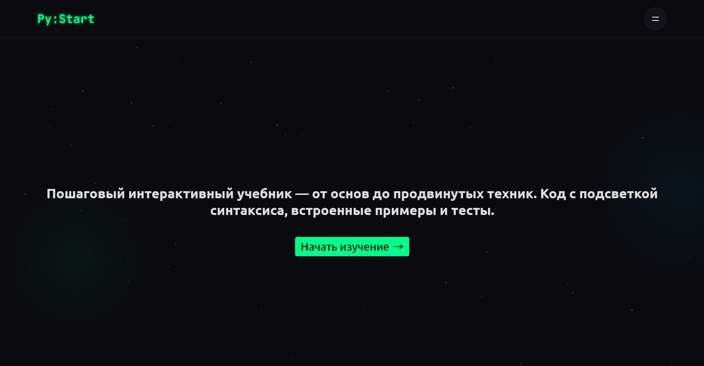

# PyStart — интерактивный учебник по Python


---

## 💡 О проекте

**PyStart** — это интерактивный учебник по основам Python, созданный для широкой
аудитории. Он идеально подойдёт новичкам, которые никогда раньше не писали код,
а также студентам любых специальностей, которым нужно освоить Python для учёбы.

Учебник построен по принципу последовательного усложнения: от переменных и типов
данных к функциям, циклам и коллекциям. Каждая глава содержит теорию, примеры
кода с подсветкой синтаксиса и интерактивные тесты для закрепления материала.

---

## ✨ Особенности

📚 **Структурированный материал** — главы идут от простого к сложному  
✅ **Интерактивные тесты** — мгновенная проверка знаний с пояснениями ошибок  
💻 **Примеры кода** — с подсветкой синтаксиса и возможностью копирования  
🎨 **Адаптивный дизайн** — удобно читать с телефона, планшета и ПК  
🎬 **Плавные анимации** — благодаря библиотеке GSAP  
⚡ **Быстрая загрузка** — статическая генерация через Astro

---

## 📸 Скриншоты

<div align="center">
  
  <p><em>Главная страница учебника</em></p>
</div>

👉 [Открыть учебник онлайн](https://zheny179.github.io/PyStart/)

---

## 🛠️ Используемые инструменты и технологии

### Основные технологии:

- **HTML5** — семантическая разметка страниц учебника
- **SCSS (Sass)** — препроцессор CSS для удобной работы со стилями, переменными
  и миксинами
- **JavaScript** — интерактивность

### Сборка и инструменты:

- **Astro (Vite)** — статический генератор сайтов, обеспечивает быструю загрузку
  и удобную работу с Markdown
- **npm** – менеджер пакетов для установки зависимостей
- **stylelint** — линтер для проверки SCSS-кода на соответствие стандартам

### Разработка и дизайн:

- **WebStorm** — IDE для написания кода
- **Figma** — дизайн интерфейса учебника

### Методология и качество:

- **БЭМ методология** — методология именования CSS-классов для
  структурированного кода
- **W3C Validator** — проверка HTML-разметки на соответствие стандартам

### Библиотеки:

- **GSAP** — библиотека для плавных анимаций появления блоков и переходов

---

## 🚀 Как запустить локально

### Требования

- Node.js версии 22.12 или выше ([скачать](https://nodejs.org/))
- Git ([скачать](https://git-scm.com/))

### Шаги установки

1. Склонируй репозиторий:
   ```bash
   git clone https://github.com/Zheny179/PyStart.git
   ```
2. Перейди в папку проекта
   ```bash
   cd PyStart
   ```
3. Установи зависимости
   ```bash
   npm i
   ```
4. Запусти проект в режиме разработки:
   ```bash
   npm run dev
   ```
5. Для сборки проекта:
   ```bash
   npm run build
   ```
6. Для просмотра собранного проекта локально:
   ```bash
   npm run preview
   ```

---

## 🎨 Структура проекта

```text
PyStart/
├── public/                               # Статические файлы
│   └── ...
├── src/                                  # Исходный код приложения
│   ├── assets/                           # Изображения, шрифты, иконки
│   ├── components/                       # Переиспользуемые UI-компоненты
│   ├── data/                             # Статические данные
│   ├── layouts/                          # Шаблоны структуры страниц
│   ├── pages/                            # Файлы роутинга (страницы)
│   ├── section/                          # Основные крупные смысловые секции главной страницы
│   └── styles/                           # Глобальные стили
│       └── helpers/                      # Scss-миксины, переменные и утилиты
├── package.json                          # Конфигурация зависимостей и скриптов npm
├── package-lock.json                     # Фиксация версий установленных модулей Node.js
├── stylelint.config.mjs                  # Конфигурация stylelint
└── tsconfig.json                         # Настройки TypeScript
```

---

## Почему Astro?

Учебник построен на статическом генераторе Astro по нескольким причинам:

- Markdown/MDX — главы удобно писать в Markdown, Astro сам превращает их в HTML
- Скорость — генерируются статические HTML-файлы, которые загружаются мгновенно
- TypeScript из коробки — типобезопасность компонентов
- "Zero JS по умолчанию" — минимум JavaScript = быстрая работа на любых
  устройствах
- Гибкость — при необходимости можно подключать интерактивные
  React/Vue/Svelte-компоненты

---

## 📜Ссылочки

- [Astro](https://astro.build/)
- [GSAP](https://gsap.com/)
- [Официальная документация Python](https://docs.python.org/3/)

---

## 📄 Лицензия

Этот проект распространяется под лицензией MIT. Подробности в
файле [LICENSE](./LICENSE).
