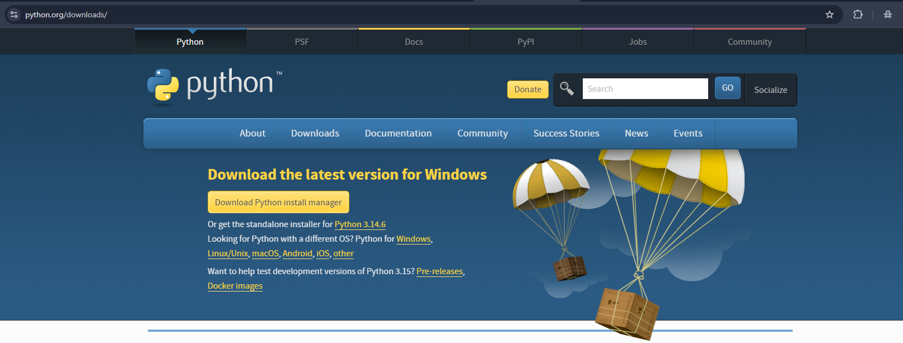
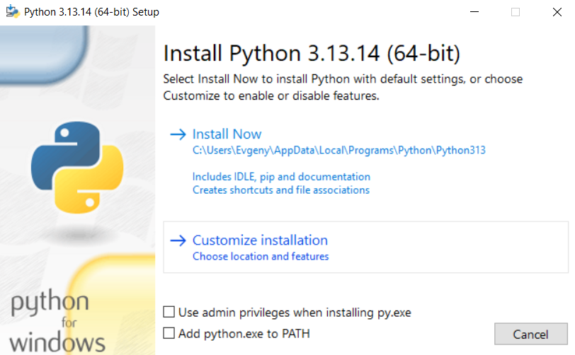
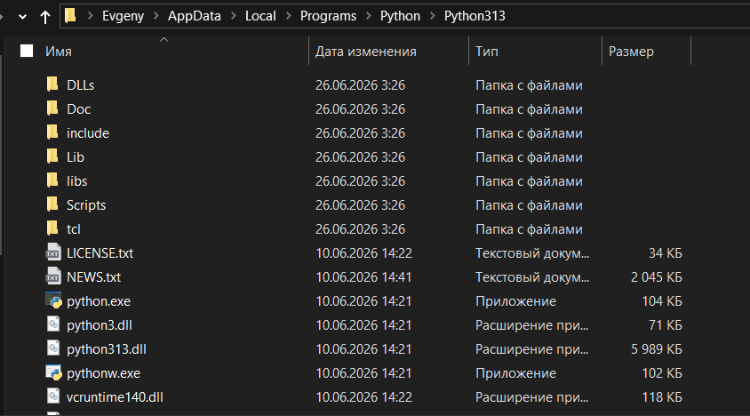
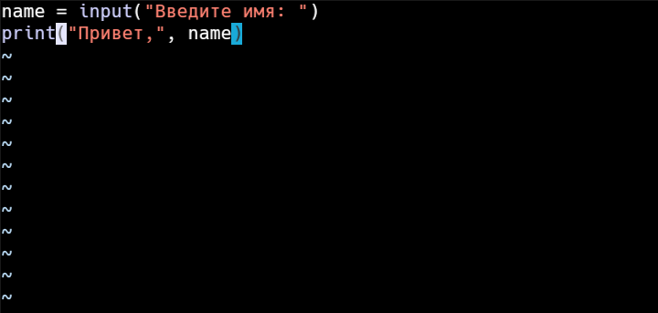
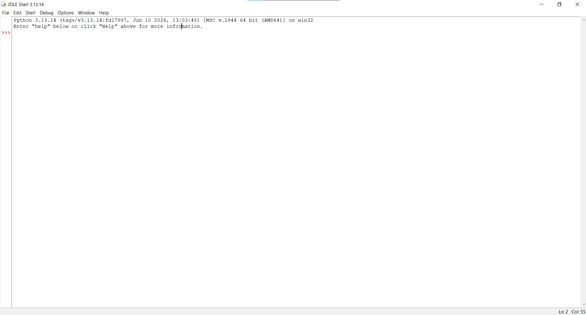

## Установка

> Следует учитывать, что современные версии языка Python (начиная с 3.9) официально не поддерживают Windows 7 и более ранние ОС.

Для создания программ на Python потребуется _интерпретатор_.

> **Интерпретатор** — специальная программа, которая читает исходный код, написанный на языке программирования, и сразу же выполняет его (строка за строкой), не преобразуя предварительно весь код в машинные инструкции.

Для установки интерпретатора нужно:

1. Перейти на официальную страницу Python — https://www.python.org/downloads/



2. Выбрать раздел Windows
3. Установить Python при помощи мастера установки



В мастере установки можно задать путь, по которому будет устанавливаться интерпретатор. Если не менять путь, то по умолчанию он будет:

```sh
C:\Users\[имя_пользователя]\AppData\Local\Programs\Python\Python313\
```

Кроме того, в самом низу при необходимости можно поставить флажок "**Add python.exe to PATH**", чтобы добавить путь к интерпретатору в переменные среды.

После установки можно проверить версию Python, запустив в командной строке/терминале команду:

```sh
python --version

Python 3.13.14
```

## Запуск интерпретатора

После установки интерпретатора можно создавать приложения на Python.

Если при установке не был изменен адрес, то на Windows Python по умолчанию устанавливается по пути C:\Users\[имя-пользователя]\AppData\Local\Programs\Python\Python[номер-версии]\ и представляет файл под названием **python.exe**.



Запустим интерпретатор и введем в него следующую строку:

```py
print("Hello, World!")
```

И консоль выведет строку:

```sh
Python 3.13.14 (tags/v3.13.14:fd17997, Jun 10 2026, 13:03:48) [MSC v.1944 64 bit (AMD64)] on win32
Type "help", "copyright", "credits" or "license" for more information.
>>> print("Hello, World!")
Hello Word!
>>>
```

Чтобы выйти из интерпретатора обратно в командную строку, введите команду `exit()` или нажмите комбинацию клавиш **Ctrl+Z**, а затем **Enter**.

## Создание файла программы

В реальной разработке программы обычно пишутся в отдельных файлах-скриптах, которые затем передаются интерпретатору на выполнение. Поэтому создадим файл программы. Для этого определим для скриптов папку с названием _python_. Внутри неё создадим новый файл, который назовем _hello.py_. По умолчанию файлы с кодом на языке Python, как правило, имеют расширение `.py`.

Откроем этот файл в любом текстовом редакторе и добавим в него следующий код:

```py
name = input("Введите имя: ")
print("Привет,", name)
```



Первая строка с помощью функции `input()` ожидает ввода пользователем своего имени. Введенное имя затем попадает в переменную name.
Вторая строка с помощью функции `print()` выводит приветствие вместе с введенным именем.
Теперь запустим командную строку/терминал. С помощью команды `cd` перейдем к папке, где находится файл с исходным кодом hello.py.

```sh
cd python/
```

Далее вначале введем полный путь к интерпретатору, а затем полный путь к файлу скрипта. К примеру, в моем случае в консоль надо будет ввести:

```sh
C:\Users\Evgeny\AppData\Local\Programs\Python\Python313\python.exe hello.py
```

Но если при установке была указана опция "**Add python.exe to PATH**", то есть путь к интерпретатору Python был добавлен в переменные среды, то вместо полного пути к интерпретатору можно просто написать:

```sh
python hello.py
```

Либо можно сократить:

```sh
py hello.py
```

В итоге программа выведет:

```sh
py hello.py

Введите имя: Евгений
Привет, Евгений
```

## IDLE

Вместе с Python устанавливается простая IDE под названием **IDLE**.



IDLE предоставляет:

- Подсветку синтаксиса
- Автодополнение кода
- Удобный запуск скриптов через F5
- Интерактивный интерпретатор
