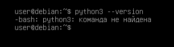

## Установка

Для создания программ на Python нам потребуется _интерпретатор_.

> **Интерпретатор** — специальная программа, которая читает исходный код, написанный на языке программирования, и сразу же выполняет его (строка за строкой), не преобразуя предварительно весь код в машинные инструкции.

Стоит отметить, что в некоторых дистрибутивах Linux (например, в Ubuntu) Python может быть установлен по умолчанию.
В примере используется Debian. Если у вас другой дистрибутив (Fedora, Arch, openSUSE), команда установки будет отличаться — используйте соответствующий менеджер пакетов (dnf, pacman, zypper).

Для проверки версии Python в терминале надо выполнить следующую команду:

```bash
python3 --version
```



В моем случае он не установлен. Однако даже если Python был установлен, его версия может быть не самой последней.

Для установки последней доступной версии Python выполним следующую команду:

```bash
sudo apt-get update && sudo apt-get install python3
```

Если надо установить какую-то определенную версию, то указывается также промежуточная версия Python. Например, установка версии Python 3.10:

```bash
sudo apt-get install python3.10
```

## Запуск интерпретатора

После установки интерпретатора можно создавать приложения на Python. Для этого нужно выполнить команду в терминале:

```bash
python3
```

В результате запускается интерпретатор Python. Введем в него следующую строку:

```py
print("Hello, World!")
```

И консоль выведет строку "Hello, World!".

Для этой программы использовалась функция `print()`, которая выводит некоторую строку на консоль.

Чтобы выйти из интерпретатора Python обратно в терминал, введите `exit()` или нажмите `Ctrl+D`.

## Создание файла программы

В реальности, как правило, программы определяются во внешних файлах-скриптах и затем передаются интерпретатору на выполнение. Поэтому создадим файл программы. Для этого определим для скриптов папку с названием _python_. Внутри неё создадим новый файл, который назовем _hello.py_. По умолчанию файлы с кодом на языке Python, как правило, имеют расширение `.py`.

```bash
# Создаём папку для скриптов
mkdir python

# Переходим в неё
cd python

# Создаём пустой файл hello.py
touch hello.py
```

Откроем этот файл в любом текстовом редакторе и добавим в него следующий код:

```py
name = input("Введите имя: ")
print("Привет,", name)
```


Первая строка с помощью функции `input()` ожидает ввода пользователем своего имени. Введенное имя затем попадает в переменную name.
Вторая строка с помощью функции `print()` выводит приветствие вместе с введенным именем.

Чтобы выполнить код внутри файла hello.py, нужно выполнить следующую команду:

```sh
python3 hello.py
```

В итоге программа выведет:

```sh
python3 hello.py

Введите имя: Евгений
Привет, Евгений
```
